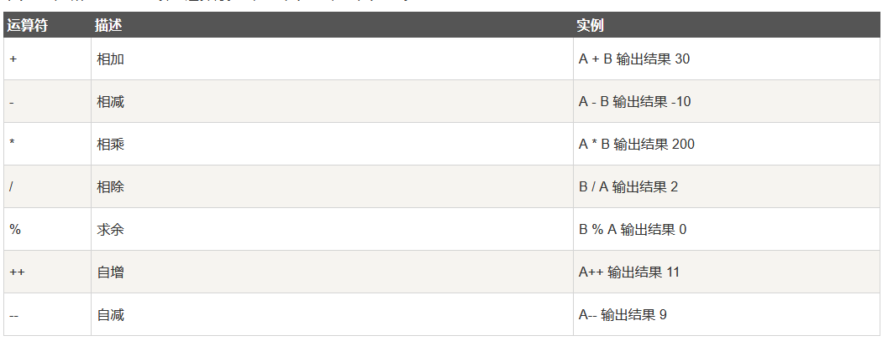
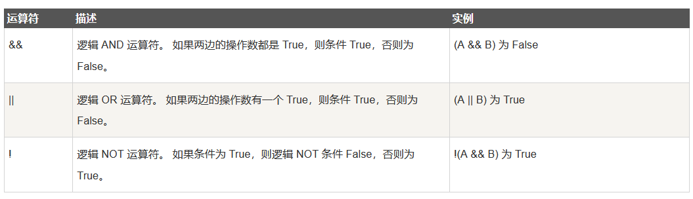
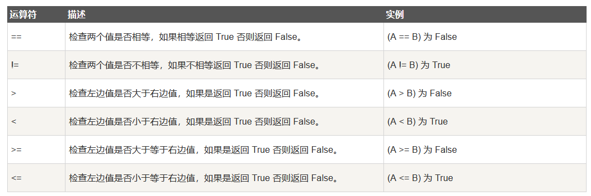
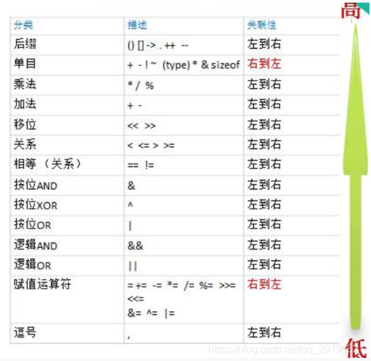

# go语言特点
①go语言是一种静态强类型语言；   
②语法简洁；  
③代码风格统一；  
④开发效率高:自带垃圾回收；  
⑤执行性能好：解释型语言，文件-->编译-->二进制文件；  
⑥天生支持并发：底层原生支持并发，无需第三方库和技巧。  
# 变量

## 标识符

 - 标识符是对变量，方法，函数等命名时使用的字符序列，由数字、字母、下划线`_`组成，且不能以数字开头。
## 关键字    
go语言中的25个关键字： 


	 - break        default       func         interface    select
	 - case         defer         go           map          struct
	 - chan         else          goto         package      switch
	 - const        fallthrough   if           range        type
	 - continue     for           import       return       var
37个预定义标识符，主要对应内建函数、内建类型、内建常量。不建议作为标识符使用：

	内建常量：    true      false     iota        nil
	内建类型：    int       int8      int16       int32       int64  
                  uint      uint8     uint16      uint32      uint64   uintptr
                  float32   float64   complex128  complex64   bool      byte   
				  rune      string    error
    内建函数：    make      len       cap         new         append    copy
	              close     delete    complex     real        imag      panic       
				  recover
## 变量的基本类型  

    bool
    string
    int、int8、int16、int32、int64
    uint、uint8、uint16、uint32、uint64、uintptr
    byte // uint8 的等价类型
    rune // int32的等价类型  代表一个 Unicode 码
    float32、float64
    complex64、complex128

## 变量的声明
* 变量必须先声明后使用 
* 变量声明了必须使用  

### 标准声明  
 变量声明以关键字 var 开头，后置变量类型，行尾无须分号。 
`var 变量名 变量类型`
### 批量声明  
使用关键字 var 和括号，可以将一组变量定义放在一起。   
```
var （
	b string
	c bool
	d float32
）
```
### 简短格式声明 
*  不能提供数据类型
*   只能用在函数内部
`变量名 := 值`
## 变量初始化和赋值
* 在 Go 语言中，变量初始化和变量赋值是两个不同的概念，变量初始化即变量声明和赋值为一条语句，变量赋值则是先声明变量，再对其进行赋值，初始化只能执行一次，赋值则可以执行多次。go语言中，对于未赋值的参数会初始化为默认值。
1. 先声明，在使用时进行初始化
```
var a int
func main() {
	a = 100
}
```
2. 声明变量的同时初始化 
`var c int = 100`
3. 类型推导
	* 此种方式可以省略`var`，编译器会根据值自动推导变量类型并初始化
 ` a := "hello"`
4. 多重变量赋值
 `i, j = 1, 2`
 ## 匿名变量
 匿名变量被用来接受一个不被需要的值，通常用于表示一个可以被忽略的值。匿名变量不占用命名空间，不会分配内存。匿名变量使用下划线`_`表示  
 `_,x = 1,2`
# 常量
* go语言中使用`const`修饰符定义一个常量，常量在定义的时候必须进行赋值,常量在使用过程中值无法改变。
`const a = 1000`
* 批量声明常量  
  ```
  const (
	a = 1
	b = 2
	c = 3
	)
  ```
 * 在使用const批量声明常量时，如果某一个常量未进行赋值，则表示它和上一行的常量值相同 
```
const (
	a = iota
	b
	c
)
```
# 运算符
## 算数运算符

## 逻辑运算符

## 关系运算符

## 位运算符

## 运算符的优先级

# 转义符

| 转义字符 | 含义 | 转义字符 | 含义       |
| -------- | ---- | -------- | ---------- |
| \a       | 响铃 | \t       | 制表符     |
| \b       | 退格 | \v       | 垂直制表符 |
| \f       | 换页 | \'       | '          |
| \n       | 换行 | \"       | "          |
| \r       |      | \\       | \          |

# 占位符
[参考链接](https://www.jianshu.com/p/66aaf908045e) 
常用的占位符：  
