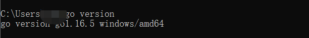
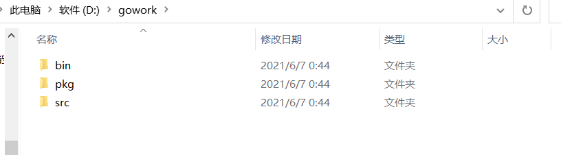
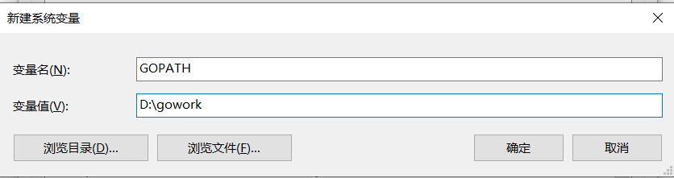
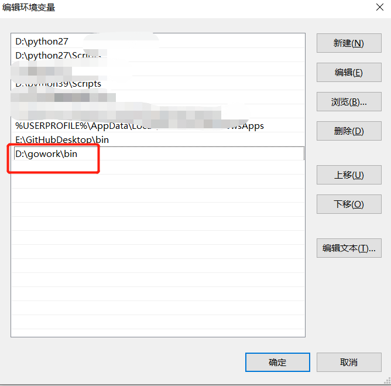
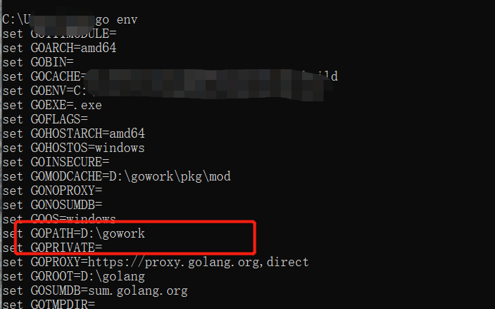
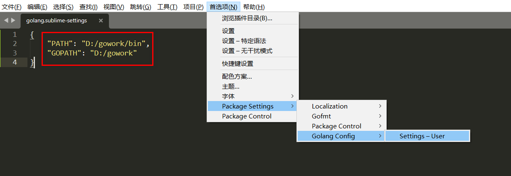
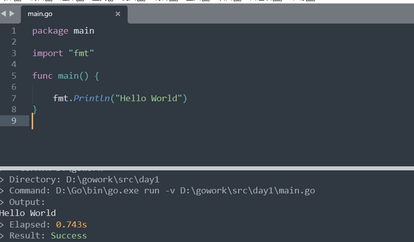
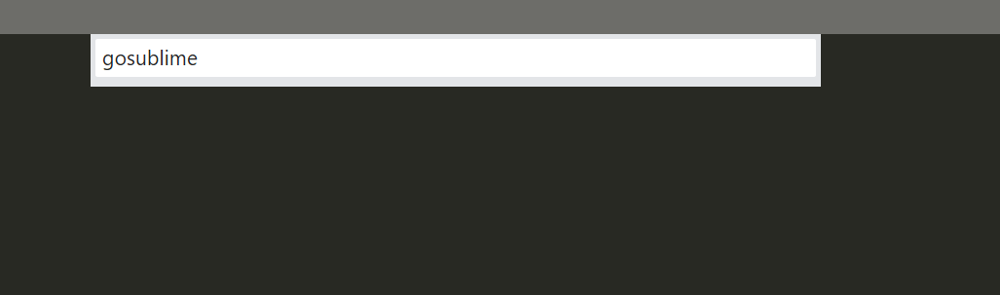
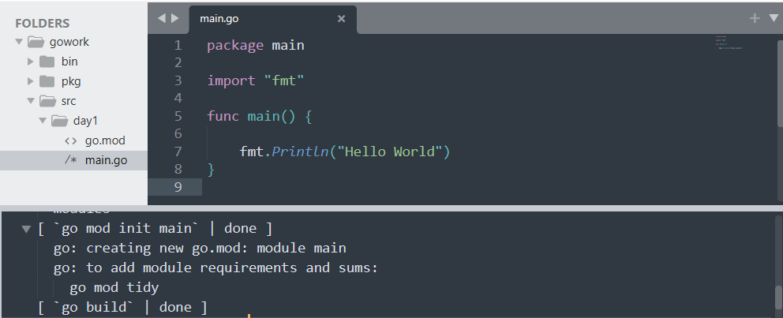
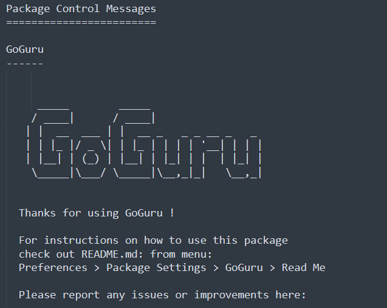

# 开发环境搭建
go开发包下载：[https://golang.org/dl/](https://golang.org/dl/)  
双击运行，选择安装路径  ，一路下一步，安装成功  
    
    
系统会自动添加环境变量，输入```go version```查看是否安装成功  
  
## 配置GOPATH
Go1.11之后不需要配置GOPATH
go项目的存放位置，默认会在```C:\Users\用户名\go```
关于`GOPATH`参考[http://c.biancheng.net/view/88.html]()  
新建`D:\gowork`，目录下新建pkg、src、bin三个文件夹，文件夹作用：  
```bin：存放go install命名生成的可执行文件。
pkg：存放go编译生成的文件。
src：存放源代码，不同工程项目的代码以包名区分。
```

计算机-->属性-->高级系统设置-->环境变量-->系统变量-->新建  
变量名处输入```GOPATH```，变量值`D:\gowork`  

将bin目录添加到Path环境变量,替换掉默认值：  

重新打开cmd，输入`go env`查看配置情况  
  
==在配置过程中，配置完GOPATH不生效，发现是默认存在GOTHPATH用户变量，删除即可 #F44336==
# sublime+Go Build插件配置golang开发环境  
## 安装Go Build：  
```
ctrl +shift +p
输入 “picp”，选择 “Package Control: Install Package” 命令运行
输入“Golang Build” 回车执行，等待安装完成，左下方会有安装提示
```
 
使用sublime编辑第一个go代码：  
```
package main
import (
    "fmt"
)
func main() {
    fmt.Println("Hello World")
}
```
使用`ctrl+b`运行，输出`Hello World`  

# 安装GoSublime
网上都说直接安装，但是实际情况下搜不到这个插件  
  
官网给的建议[https://margo.sh/b/migrate](https://margo.sh/b/migrate)
无奈选择手工安装：  
下载地址：[https://github.com/DisposaBoy/GoSublime]()  
下载完成后将gosublime的代码下载到sublime的package目录下并重命名为`GoSublime`：
  
到这里已经安装完成，如果想在ctrl + B 调出的控制台运行代码，还需要配置一下margo文件：  
1·在 Browse Package打开的路径下，找到GoSublime/src目录，之中新建`margo`目录  
2·把`C:\Users\xin\AppData\Roaming\Sublime Text\Packages\GoSublime\src\margo.sh\extension-example\extension-example.go`这个文件复制到刚刚新建的目录margo下。并改名为`margo.go`  
重启sublime，安装成功：  


## 安装Gofmt  
Gofmt 插件用于格式化代码，提高代码可读性  
```
ctrl + shift +p
输入 “picp”，选择 “Package Control: Install Package” 命令运行
输入“Gofmt” 回车执行，等待安装完成，左下方会有安装提示
```
## 安装gocode  
gocode主要用于代码补全，下载地址和安装方法：  
[https://github.com/mdempsky/gocode]()  
## 安装GoGuru

