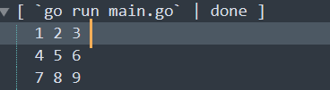

# 数组
## 数组的特点
①固定长度
②固定类型
③go语言中的数组的长度是数组类型的一部分
## 数组的定义
```
var 数组名[数组长度]类型
var arry_a[10]int32
```
## 数组的初始化
1. 常规初始化方法：
`var a [3]int16 = [4]int16{4, 5, 6}`
2. 使用字面量初始化：
`c := [3]int{7, 8, 9}`
3. 通过指定索引的方式初始化：
`g := [3]int64{0: 1, 2: 2}//此种方法会对未指定的位置初始化为默认零值`
4. 不定义数组长度，让编译器自行推导  ：
`f := []int{100, 22, 55, 66, 88}` 
`f := [...]int{100, 22, 55, 66, 88}`
## 数组的遍历
go语言中的数组跟python、C中的遍历方式类似，根据下标索引，下标范围`0,len(arry)-1`，

* 使用 `for range`遍历，可以返回数组的索引值
 ```
 arry := []string{"hello", "world"}
	for j, v := range arry {
		fmt.Printf("索引:%d 值:%s", j, v)
	}
	//索引:0 值:hello索引:1 值:world
 ```
## 多维数组
1. 定义多维数组：
```
	a := [3][3]int{
		{1, 2, 3},
		{4, 5, 6},
		{7, 8, 9},
	}
```
* 多维数组在定义的过程中只有第一层可以通过`[]`和`[...]`代替数组的长度。
2. 多维数组的遍历
```
	a := [3][3]int{
		{1, 2, 3},
		{4, 5, 6},
		{7, 8, 9},
	}
	for _, value_1 := range a {
		for _, value_2 := range value_1 {
			fmt.Printf("%d\t", value_2)
		}
		fmt.Println()
	}
```
  
